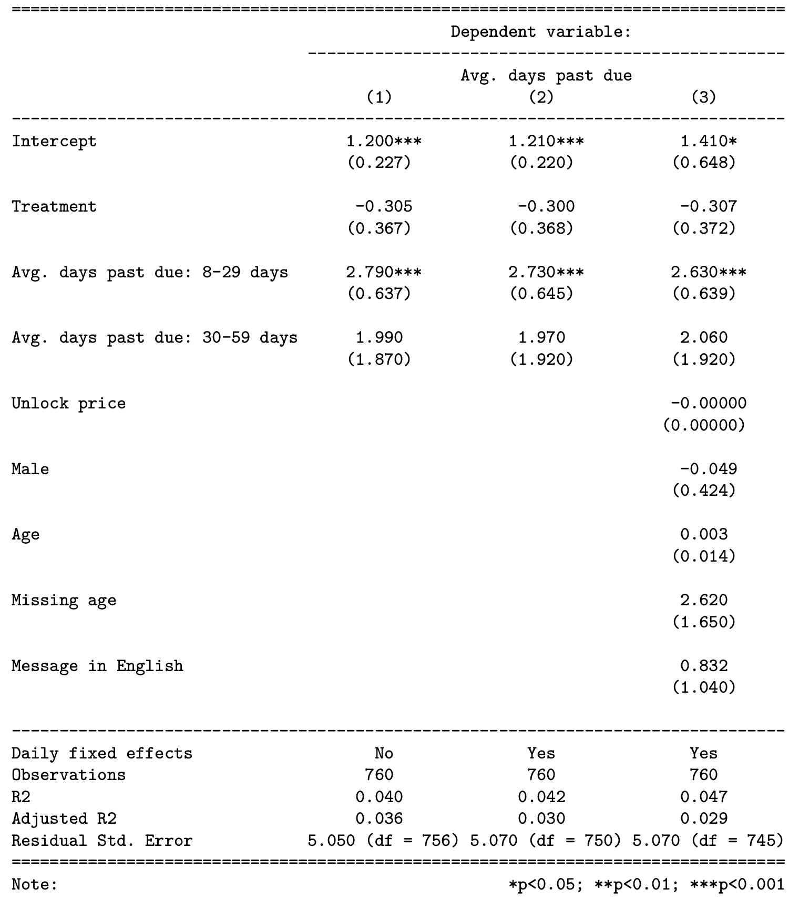

# A/B Testing
## Randomized controlled trial of text message payment reminders to improve solar home system repayments

## `Repo Organization`

All analysis was conducted in `R` using various statistical libraries such as `data.table`, `sandwich`, `tidyverse`, `lmtest`, and `stargazer`.
. All code and written works have been redacted for privacy.

* **`generate_messages`**: code to create daily reminder messages, which were fed into CRM messaging platform.

* **`post_experiment_code`**: R markdown files used after experiment was complete to measure average treatment effect, controlling for various fixed effects

* **`pre_experiment_code`**: R markdown files to split participants into treatment and control groups, conduct power analysis

* **`report`**: Final report, redacted.

## Problem Description
570 million people in Sub-Saharan Africa lack a connection to an national electric grid. Gasoline powered generators and kerosene laterns rely on expensive fuel while emitting tons of dioxide and other air pollutants. Off-grid solar home systems offer a zero carbon power solution that is more cost effective in the longer term than conventional energy technologies. However, the upfront costs of solar home systems often exceed families’ ability to pay out of pocket so many customers pay for these systems on a pay-as-you-go payment plan. Solar retailers with customers buy products on credit send text message reminders in an attempt to improve customer repayment. In conjunction with a solar retailer in Sub-Saharan Africa, Catalyst Energy Advisors, and two other fellow graduate students at the UC Berkeley School of Information, I ran an A/B test to answer the following question: “How do text message reminders that implement minority norm framing rather than the previously utilized loss framing affect the timing of repayments for pay-as-you-go solar customers who buy at-home solar products on credit?”

## The Experiment
To measure the effect of text messages, we tracked customers days past due at time of repayment, which is a measure of the amount of time elapsed between the expected payment date and actual payment date. We also recorded collection rate, a ratio comparing the amount expected to the amount actually paid. We ran a 5 week field experiment using blocked random assignment to assign treatment or control on a sample of 760 customers in June and July of 2022. As customers approached a payment due date, they were sent upcoming reminder messages with the control or treatment wording. In the case that customers did not pay by the expected payment date, they were sent late payment reminders 1, 7, 14, 21, and 28 days after the scheduled payment date. Sample upcoming reminders in English (actual messages were sent in English and another language depending on customers preferred language)

## Results
We failed to detect a statistically significant effect of the treatment on the average days past due between treatment and control groups, even when controling for a variety of customer attributes and including fixed effects of day of the week.

